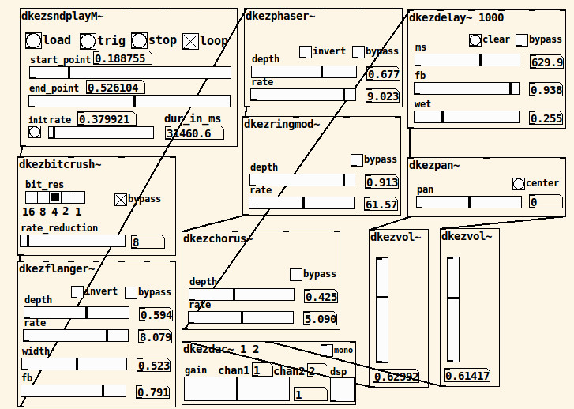

# pdkez
EZ use (has GUI) Pd vanilla abstractions.

Originally developed for teaching effects in UC Davis's Music 107A: Introduction to Electronic Music.

Distributed under GPL v3.

Abstraction names should be relatively self-explanatory.

some abstractions need [pdkvabs](https://github.com/derekxkwan/pdkvabs) (whose contents should be flattened into one folder). These are in the *ezvabs* folder and should be put in the main pdkez folder before use.

helper patches (not meant to be used directly) are suffixed by _h

dkezfreeverb~ based around Katja Vetter's May 2012 implementation of freeverb with vanilla objects (will tidy up soon)
