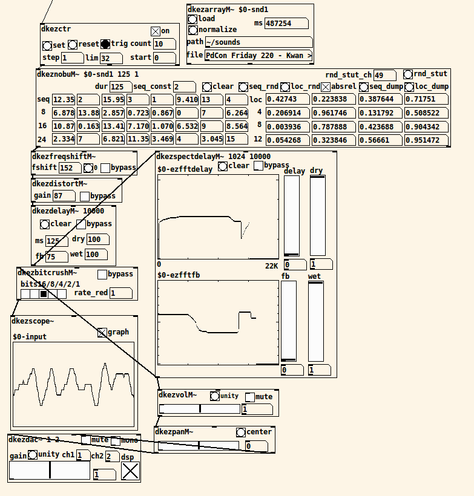

# pdkez
GUI-centric wrappers around Pd abstractions

Originally developed for teaching effects in UC Davis's Music 107A: Introduction to Electronic Music. Evolved into use with live improvisation.

Distributed under GPL v3.

Abstraction names should be relatively self-explanatory.

some abstractions need [pdkvabs](https://github.com/derekxkwan/pdkvabs) (whose contents besides the util folder should be flattened into one folder). These are in the *ezvabs* folder and should be put in the main pdkez folder before use. Similarly with [pdklist](https://github.com/derekxkwan/pdklist) and *ezlist*.

helper patches (not meant to be used directly) are suffixed by _h

abstractions include spectral delay, spectral gating, spectral filtering, time-based effects, waveshaping and granular synthesis. there are also abstractions for volume, dac, adc, array loading, and playback.

dkezfreeverb~ based around Katja Vetter's May 2012 implementation of freeverb with vanilla objects (will tidy up soon)
